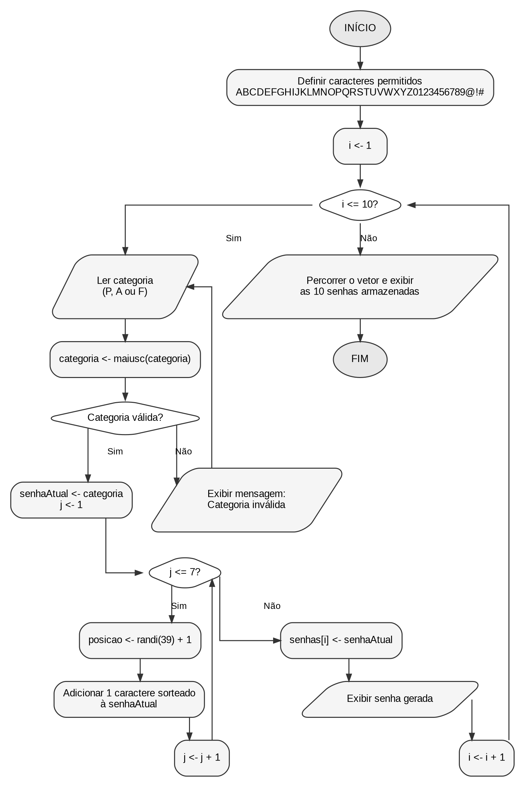

**CENTRO ESTADUAL DE EDUCAÇÃO TECNOLÓGICA PAULA SOUZA**

**FACULDADE DE TECNOLOGIA DE LINS PROF. ANTONIO SEABRA**

**CURSO SUPERIOR DE TECNOLOGIA EM ANÁLISE E DESENVOLVIMENTO DE SISTEMAS**

**RICHARD DE OLIVEIRA BARRA JUNIOR**

**MATHEUS SOARES GOMES**

**GUSTAVO WILLIAN GODOY DA SILVA**

**MARCELO CARDOSO VENDRAME**

**DESENVOLVIMENTO DE ALGORITMO PARA GERAÇÃO DE SENHAS ALEATÓRIAS**

**POR CATEGORIA DE USUÁRIO**

Módulo de Geração de Senhas em VisualG

**LINS/SP**

**1º SEMESTRE/2026**

**RESUMO**

Este trabalho apresenta o desenvolvimento de um algoritmo para geração de senhas aleatórias por categoria de usuário, implementado na linguagem utilizada pelo VisualG. O programa solicita a categoria de acesso, aceita exclusivamente Professor, Aluno ou Funcionário, gera dez senhas e armazena os resultados em um vetor de dez posições. Cada senha possui exatamente oito caracteres: o primeiro identifica a categoria informada e os sete restantes são sorteados a partir do conjunto autorizado de letras maiúsculas, algarismos e símbolos especiais. A solução emprega estruturas condicionais, laços de repetição, manipulação de cadeias de caracteres e vetor. Também foi elaborado um fluxograma para representar o processamento completo, desde a validação da entrada até a exibição final das dez senhas armazenadas. A análise dos requisitos identificou divergências de tamanho em alguns exemplos fornecidos no enunciado; por isso, a implementação prioriza a regra explícita que determina o total de oito caracteres. Os testes demonstram que o algoritmo atende aos requisitos estabelecidos e pode ser executado no VisualG.

**Palavras-chave:** Algoritmos. VisualG. Senhas aleatórias. Vetores. Estruturas de repetição.

**SUMÁRIO**

1 INTRODUÇÃO 4

2 ANÁLISE DOS REQUISITOS 4

3 FUNDAMENTAÇÃO E REVISÃO DOS COMANDOS DO VISUALG 5

4 DESENVOLVIMENTO DO ALGORITMO 6

5 FLUXOGRAMA 8

6 TESTES E VALIDAÇÃO 10

7 CONCLUSÃO 11

REFERÊNCIAS 12

**1 INTRODUÇÃO**

A geração de senhas é uma tarefa recorrente em sistemas computacionais que precisam controlar o acesso de diferentes perfis de usuário. Neste projeto, o problema foi delimitado à criação de um módulo didático capaz de produzir senhas aleatórias para professores, alunos e funcionários. A proposta permite aplicar conceitos fundamentais de lógica de programação em uma situação prática: entrada de dados, validação, repetição, vetores e manipulação de textos.

O enunciado da atividade determina que sejam geradas dez senhas. Cada uma deve possuir exatamente oito caracteres e começar pela letra correspondente à categoria informada: P para Professor, A para Aluno e F para Funcionário. Os demais caracteres devem ser escolhidos aleatoriamente em um conjunto previamente definido. A solução foi desenvolvida com a sintaxe própria do VisualG, um ambiente utilizado para edição e execução de algoritmos em português estruturado.

O objetivo deste trabalho é apresentar a análise dos requisitos, revisar os comandos empregados, implementar o algoritmo completo, representar seu funcionamento por meio de um fluxograma e verificar o atendimento das regras estabelecidas na atividade.

**2 ANÁLISE DOS REQUISITOS**

A leitura das instruções permitiu separar as exigências funcionais do módulo. O Quadro 2.1 consolida as regras que orientaram a implementação. A distinção entre regras obrigatórias e exemplos ilustrativos foi importante para evitar que uma inconsistência do enunciado fosse reproduzida no algoritmo.

Quadro 2.1 - Requisitos obrigatórios do módulo

| **Item** | **Requisito**                                | **Aplicação na solução**                                     |
|----------|----------------------------------------------|--------------------------------------------------------------|
| 1        | Gerar dez senhas aleatórias.                 | Laço externo executado dez vezes.                            |
| 2        | Armazenar as senhas geradas.                 | Vetor senhas com posições de 1 a 10.                         |
| 3        | Validar a categoria de usuário.              | Entrada aceita somente P, A ou F.                            |
| 4        | Criar senhas com exatamente oito caracteres. | Categoria na primeira posição e sete caracteres sorteados.   |
| 5        | Respeitar o primeiro caractere obrigatório.  | A senha inicia com a categoria validada.                     |
| 6        | Usar somente caracteres autorizados.         | Sorteio realizado dentro da cadeia de caracteres permitidos. |
| 7        | Exibir cada senha e a lista final.           | Saída imediata após a geração e nova exibição ao final.      |

Fonte: Elaborado pelo autor com base nas instruções da atividade, 2026.

**2.1 Divergência identificada nos exemplos**

O documento da atividade estabelece explicitamente que a senha deve possuir oito caracteres. Entretanto, os exemplos apresentados para Professor e Funcionário possuem quantidade superior ao limite informado. Como uma regra obrigatória tem prioridade sobre exemplos ilustrativos, o algoritmo foi construído com oito caracteres em todos os casos: uma letra de categoria e sete caracteres aleatórios.

**3 FUNDAMENTAÇÃO E REVISÃO DOS COMANDOS DO VISUALG**

O VisualG utiliza uma forma de português estruturado própria. Sua estrutura básica é delimitada por algoritmo, var, inicio e fimalgoritmo. O manual consultado informa que o tipo caractere representa cadeias de caracteres e que vetores são declarados com a sintaxe vetor\[índice inicial..índice final\] de tipo (RODRIGUES, \[s.d.\]).

A revisão também mostrou que o operador de atribuição adequado é \<-. Para comparação, utiliza-se =, enquanto \<\> representa a diferença entre valores. O algoritmo não emprega ponto e vírgula ao fim de cada comando, pois essa pontuação não é necessária na sintaxe do VisualG. Além disso, não são utilizados blocos internos com Inicio e Fim: cada estrutura possui seu encerramento específico, como fimse e fimpara.

Quadro 3.1 - Comandos utilizados na implementação

| **Comando ou função**                   | **Finalidade no algoritmo**                                |
|-----------------------------------------|------------------------------------------------------------|
| algoritmo / var / inicio / fimalgoritmo | Delimitam a estrutura principal do programa.               |
| caractere e inteiro                     | Declaram textos e valores numéricos inteiros.              |
| \<-                                     | Atribui um valor a uma variável ou a uma posição do vetor. |
| se ... entao / fimse                    | Exibe mensagem quando a categoria informada é inválida.    |
| repita ... ate                          | Repete a leitura até que a categoria seja P, A ou F.       |
| para ... de ... ate ... faca / fimpara  | Controla as dez senhas e os sete caracteres sorteados.     |
| vetor\[1..10\] de caractere             | Armazena as dez senhas geradas.                            |
| maiusc(texto)                           | Padroniza a categoria digitada em letra maiúscula.         |
| randi(39) + 1                           | Sorteia uma posição entre 1 e 39.                          |
| copia(texto, posição, 1)                | Extrai um caractere do conjunto permitido.                 |
| \+                                      | Concatena textos para formar cada senha.                   |

Fonte: Elaborado pelo autor com base no Manual do VisuAlg e na documentação do VisuAlg Web.

A função RandI(limite) gera valores inteiros entre zero e uma unidade abaixo do limite. Por esse motivo, a expressão randi(39) + 1 produz posições entre 1 e 39. A função copia(texto, inicio, quantidade) permite retirar somente o caractere sorteado, enquanto maiusc(texto) padroniza a categoria informada pelo usuário (VISUALG 3.0.5.2, \[s.d.\]).

O conjunto permitido contém 39 elementos: 26 letras maiúsculas, dez algarismos e três símbolos especiais. A composição da senha é feita por concatenação, começando pela categoria e acrescentando sete caracteres sorteados. A página do projeto VisualG 3.0 no SourceForge informa que a versão 3.0.7.0 mantém compatibilidade com comandos antigos; por esse motivo, foram utilizadas palavras-chave sem acentuação no código, reduzindo possíveis diferenças entre instalações (NICOLÓDI, 2020).

**4 DESENVOLVIMENTO DO ALGORITMO**

O processamento foi organizado em três níveis. O primeiro laço gera as dez senhas. Dentro dele, um laço repita...ate valida a categoria correspondente ao usuário atual. Depois da validação, outro laço para executa sete sorteios e completa a senha. Cada resultado é armazenado no vetor e exibido imediatamente. Ao término das dez iterações, o vetor é percorrido novamente para apresentar a lista final.

**4.1 Código-fonte completo em VisualG**

```text
algoritmo "gerador_de_senhas_por_categoria"
 
var
   senhas: vetor[1..10] de caractere
   caracteresPermitidos, categoria, senhaAtual: caractere
   i, j, posicao: inteiro
 
inicio
   caracteresPermitidos <- "ABCDEFGHIJKLMNOPQRSTUVWXYZ0123456789@!#"
 
   para i de 1 ate 10 faca
      repita
         escreval("")
         escreval("Geracao da senha ", i, " de 10")
         escreval("Informe a categoria do usuario:")
         escreva("P - Professor, A - Aluno ou F - Funcionario: ")
         leia(categoria)
         categoria <- maiusc(categoria)
 
         se (categoria <> "P") e (categoria <> "A") e (categoria <> "F") entao
            escreval("Categoria invalida. Digite somente P, A ou F.")
         fimse
      ate (categoria = "P") ou (categoria = "A") ou (categoria = "F")
 
      senhaAtual <- categoria
 
      para j de 1 ate 7 faca
         posicao <- randi(39) + 1
         senhaAtual <- senhaAtual + copia(caracteresPermitidos, posicao, 1)
      fimpara
 
      senhas[i] <- senhaAtual
      escreval("Senha gerada: ", senhas[i])
   fimpara
 
   escreval("")
   escreval("LISTA FINAL DAS 10 SENHAS GERADAS")
 
   para i de 1 ate 10 faca
      escreval(i, " - ", senhas[i])
   fimpara
 
fimalgoritmo
```

No algoritmo, a categoria é solicitada em cada uma das dez iterações. Essa decisão permite gerar, em uma mesma execução, senhas destinadas a usuários de categorias diferentes. Caso seja necessário produzir dez senhas para uma única categoria, basta mover a etapa de leitura e validação para antes do primeiro laço para. A versão apresentada é mais abrangente e continua obedecendo integralmente às regras da atividade.

**5 FLUXOGRAMA**

O fluxograma da Figura 5.1 representa o funcionamento completo do programa. O retorno à leitura da categoria ocorre sempre que uma entrada inválida é identificada. Após a validação, sete caracteres são sorteados e concatenados ao primeiro caractere obrigatório. O ciclo se repete até que o vetor possua dez senhas, quando então ocorre a exibição final.

Figura 5.1 - Fluxograma do módulo de geração de senhas



Fonte: Elaborado pelo autor, 2026.

**6 TESTES E VALIDAÇÃO**

Para conferir a implementação, foram considerados cenários de entrada válida, entrada inválida e geração mista de categorias. Como os caracteres após a primeira posição são aleatórios, os resultados mudam a cada execução. O Quadro 6.1 apresenta uma simulação de saída coerente com as regras do algoritmo.

Quadro 6.1 - Exemplo de vetor preenchido após uma execução

| **Posição** | **Categoria** | **Senha gerada** | **Tamanho** | **Válida** |
|-------------|---------------|------------------|-------------|------------|
| 1           | P             | PLD9NHR!         | 8           | Sim        |
| 2           | A             | A9L40N58         | 8           | Sim        |
| 3           | F             | FXZAXJ6!         | 8           | Sim        |
| 4           | P             | PQASU3XO         | 8           | Sim        |
| 5           | A             | AVF8MV64         | 8           | Sim        |
| 6           | F             | F7Z8J41#         | 8           | Sim        |
| 7           | P             | P8JCHX3C         | 8           | Sim        |
| 8           | A             | A8G1O0A2         | 8           | Sim        |
| 9           | F             | F57KEV6X         | 8           | Sim        |
| 10          | P             | P#E5W#EQ         | 8           | Sim        |

Fonte: Elaborado pelo autor, 2026. Os valores são ilustrativos, pois a execução utiliza sorteio.

**6.1 Verificação dos requisitos**

Quadro 6.2 - Conferência final da implementação

| **Regra verificada**                                  | **Resultado** | **Justificativa**                                                          |
|-------------------------------------------------------|---------------|----------------------------------------------------------------------------|
| Somente categorias P, A e F são aceitas.              | Atendida      | O laço repita...ate impede a continuidade até a entrada ser válida.        |
| São produzidas dez senhas.                            | Atendida      | O laço externo percorre i de 1 até 10.                                     |
| Cada senha tem oito caracteres.                       | Atendida      | A categoria ocupa uma posição e o laço interno acrescenta sete caracteres. |
| O primeiro caractere informa a categoria.             | Atendida      | senhaAtual recebe categoria antes dos sorteios.                            |
| Os demais caracteres pertencem ao conjunto permitido. | Atendida      | copia extrai caracteres somente da cadeia autorizada.                      |
| As senhas são armazenadas em vetor.                   | Atendida      | Cada resultado é atribuído a senhas\[i\].                                  |
| As dez senhas são exibidas ao final.                  | Atendida      | O vetor é percorrido novamente após a geração.                             |

Fonte: Elaborado pelo autor, 2026.

O teste de categoria inválida também deve ser realizado na execução do VisualG. Ao informar, por exemplo, a letra X, o programa exibe a mensagem de erro e retorna à leitura. Somente após a entrada de P, A ou F a senha correspondente é criada.

**7 CONCLUSÃO**

O algoritmo desenvolvido atende às exigências apresentadas na atividade interdisciplinar. A solução gera dez senhas aleatórias, valida a categoria de cada usuário, garante o primeiro caractere obrigatório, limita cada resultado a oito caracteres, utiliza somente o conjunto autorizado e armazena os dados em vetor. O fluxograma complementa a implementação ao demonstrar visualmente os ciclos de validação, sorteio, armazenamento e exibição.

A revisão da sintaxe evitou a mistura entre a linguagem algorítmica genérica e os comandos específicos do VisualG. Foram empregados o operador de atribuição \<-, o tipo caractere, a declaração adequada de vetor, os encerramentos fimse e fimpara e as funções randi, maiusc e copia. Também foi registrada a divergência existente nos exemplos do enunciado, preservando como critério principal a regra explícita de oito caracteres.

**REFERÊNCIAS**

FACULDADE DE TECNOLOGIA DE LINS PROF. ANTONIO SEABRA. Projeto interdisciplinar com atividades de curricularização da extensão: desenvolvimento de algoritmo para geração de senhas aleatórias por categoria de usuário. Lins, 2026. Material da atividade.

NICOLÓDI, Antonio Carlos. VISUALG 3.0. SourceForge, 2020. Disponível em: \<https://sourceforge.net/projects/visualg30/\>. Acesso em: 10 jun. 2026.

RODRIGUES, Arley. Manual do VisuAlg. \[S. l.\]: Instituto Federal de Educação, Ciência e Tecnologia, \[s. d.\]. Disponível em: \<https://www.inf.ufsc.br/~bosco/ensino/ine5201/Visualg2_manual.pdf\>. Acesso em: 10 jun. 2026.

VISUALG 3.0.5.2 (MADEIRA). Funções do Visualg. Documentation.Help, \[s. d.\]. Disponível em: \<https://documentation.help/VISUALG-Versao/funcoes.htm\>. Acesso em: 10 jun. 2026.

VISUALG WEB. Fatiando e analisando textos. \[S. l.\], \[s. d.\]. Disponível em: \<https://visualg.com.br/aprender/visualg/manipulacao-strings/\>. Acesso em: 10 jun. 2026.

VISUALG WEB. Listas unidimensionais. \[S. l.\], \[s. d.\]. Disponível em: \<https://visualg.com.br/aprender/visualg/vetores/\>. Acesso em: 10 jun. 2026.

VISUALG WEB. Sorteios (RandI). \[S. l.\], \[s. d.\]. Disponível em: \<https://visualg.com.br/aprender/visualg/aleatoriedade/\>. Acesso em: 10 jun. 2026.
