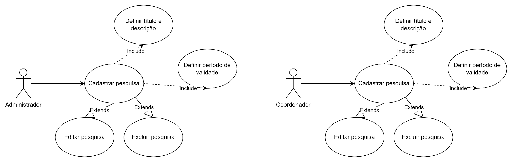
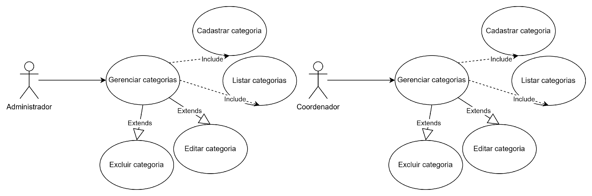
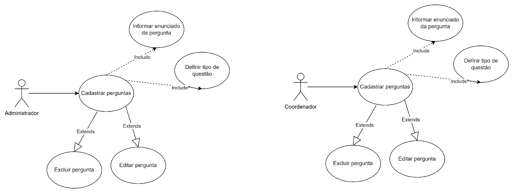
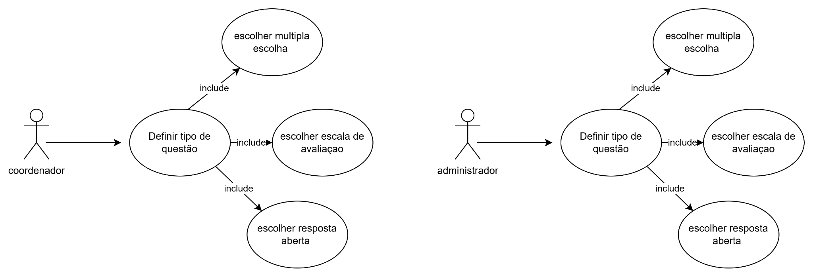
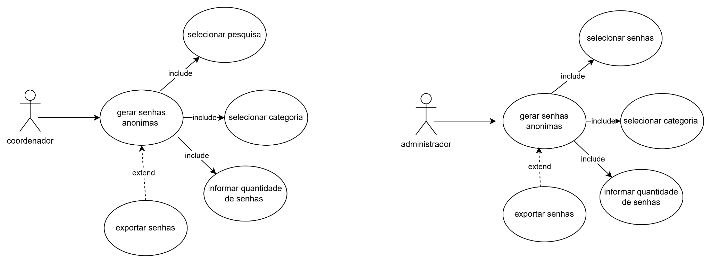
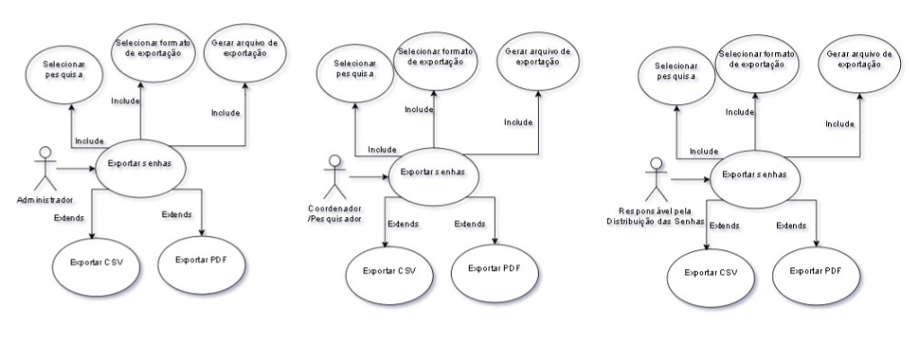
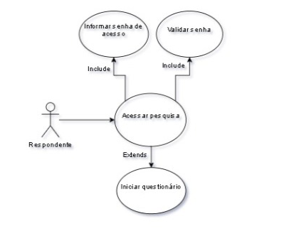
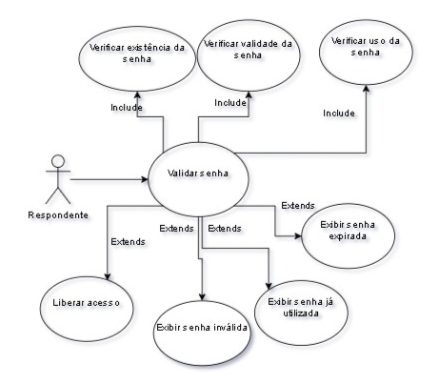

# Diagramas de casos de uso existentes

Origem: seção 8 de [p2-engs.md](../../../2026-1/engenharia-de-software/p2-engs.md). As nove imagens foram extraídas sem alteração. O documento contém diagramas RF01 a RF09; não foram encontrados diagramas RF10 a RF15, de classes ou de sequência.

[Requisitos](../requisitos.md) | [Fluxos textuais](especificacao.md)

## RF01

## RF02

## RF03

## RF04

## RF05

## RF06

## RF07

## RF08

## RF09

